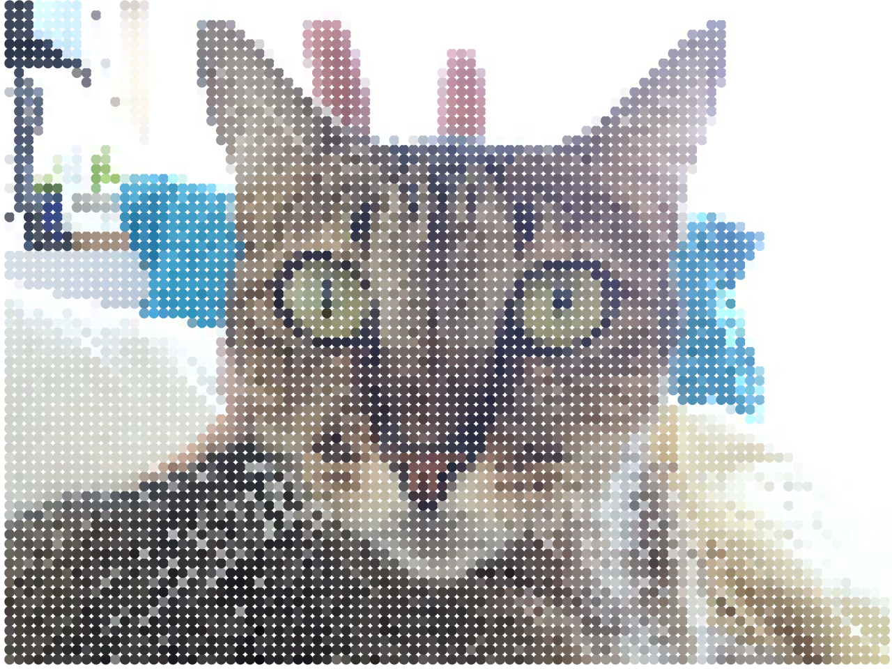

# Reticulate

This is a basic halftone effect using [Drawbot](https://www.drawbot.com/)/Python.

## How to

    reticulate(image_path, resolution, dot_size)

**image_path**: URL or local file path  
**resolution**: how many dots per row  
**dot_size**: the size of dot  

## Example

